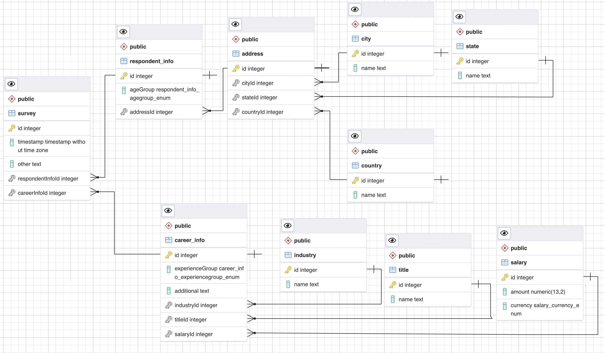

# Salery survey

## Description
Storing survey result in to database and provide api to insert, get and filter data result.

Salary survey API server using Typescript, Nest.js, Postgres.
Using docker compose to ship the app.

## Installation

```bash
$ yarn install
```
or
```bash
$ npm install
```

## Running the app

```bash
# development
$ docker-compose up
```

open swagger api doc in `localhost:3000/api`

```bash
# production mode
$ docker-compose -f docker-compose.prod.yml up
```
open swagger api doc in `localhost:8080/api`

## API endpoint

Path                    | Method | description                          | example
------------------------|--------|--------------------------------------|---------------------------------------------------------------------------------------------------------------------------------------------------------------------------------------------------------------------------------------------------------------------------------------------------------------------
/ping                   | GET    | server health check                  | `curl -X 'GET' 'http://localhost:3000/ping' -H 'accept: */*'`
/survey                 | GET    | Get all survey.                      | `curl -X 'GET' 'http://localhost:3000/survey?from=1&to=100' -H 'accept: */*'`
/survey                 | PUT    | insert a new survey                  | `curl -X 'PUT' 'http://localhost:3000/survey' -H 'accept: */*' -H 'Content-Type: application/json'  -d '{"ageGroup": "0-18",  "industry": "industry",  "title": "industry","salary": 1000,"currency": "GBP","city": "city","state": "state","country": "country","experience": "0-1","additional": "","other": ""}'`
/survey/{id}            | GET    | Get survey by ID                     | `curl -X 'GET' 'http://localhost:3000/survey/3'  -H 'accept: */*'`
/survey/{id}            | POST   | update survey by ID                  | `curl -X 'POST' 'http://localhost:3000/survey/3' -H 'accept: */*' -H 'Content-Type: application/json' -d '{"other": "string"}'`
/survey/{id}            | DELETE | delete survey by ID                  | `curl -X 'DELETE' 'http://localhost:3000/survey/3' -H 'accept: */*'`
/survey/salary/averager | GET    | get averager salary by title keyword | `curl -X 'GET' 'http://localhost:3000/survey/salary/averager?title=manager&currency=JPY' -H 'accept: */*'`
/survey/data/filter     | GET    | get survey with filter param         | `curl -X 'GET' 'http://localhost:3000/survey/data/filter?ageGroup=25-34&title=manager' -H 'accept: */*'`


## Database Schema


## Script to import data json

```bash
$ node tool/importJosnToDb.js path/to/data.json (databaseHost:default=localhost) (databasePort:default=5432)
```

Data json sample:
```json
[
  {
    "Timestamp": "4/24/2019 11:43:21", // timestamp
    "How old are you?": "35-44", // ageGroup
    "What industry do you work in?": "Government", // industry
    "Job title": "Talent Management Asst. Director", // title
    "What is your annual salary?": "75000", // amount
    "Please indicate the currency": "USD", // currency
    "Where are you located? (City/state/country)": "Nashville, TN", // city/state/country
    "How many years of post-college professional work experience do you have?": "11 - 20 years", // experience
    "If your job title needs additional context, please clarify here:": "", // additional
    "If \"Other,\" please indicate the currency here:": "" // other
  },
]
```
